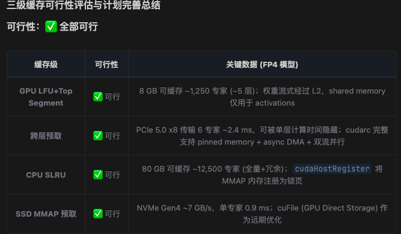

# Agent 备忘录

`ds4.rs` 是 DeepSeek V4 Flash 的专用单机推理引擎，基于96G DDR5+RTX5060Ti16G定制开发。目标是构建一个小巧、可读、高性能的 Rust 代码库，复刻inference目录下官方推理，inference目录下官方TileLang（Python）将算子编译成共享库（.so），然后在Rust加载执行。内核存放在 `tilelang/` 目录下。

## 目标

- 尽可能保持生产路径为全GPU推理，效率优先可例外；
- 官方推理逻辑无需验证，根据本地硬件配置调整。
- 复刻inference目录下python转为TileLang，使用TileLang Mega-kernel能力构建常用算子；
- 非路由专家常驻GPU；
- 路由专家三级缓存：权重流式经过L2,shared memory 仅用于高频访问的activations与临时buffers。
    首要目标推理过程隐藏PCIe传输延迟：根据GPU的算力，优化动态调整GPU/内存缓存大小；根据内存容量，动态调整SSD异步预取层数L+N；避免缓存命中率低导致的传输延迟。
    GPU缓存热点路由专家：LFU+Top Segment缓存+DMA异步读取Bottom Segment CPU缓存 ；隐藏PCIe传输延迟；   
    跨层预取：L层计算预测L+1层可能专家集合，cuda stream+pinned memory异步从gpu ram拷贝到gpu空闲槽位；隐藏PCIe传输延迟；
    内存缓存路由专家：内存划分路由专家SLRU缓存与预取L1-N层路由专家，SSD MMAP预取；推理效率优先动态划分；
    SSD5 PCIe5x8 独立缓存，15G/s:全量路由专家；路由专家SSD MMAP预取；
- 正确性优先于速度。不要保留存在未解释注意力、KV 缓存或 logits 漂移的更快路径;
- kvcache 完全在GPU上实现，GPU 化的 Compressor 和 Indexer，缓存落盘支持热启动;
- 支持插件机制，方便扩展功能。
- MTP收益不高，不建议使用。
- 尽可能用TileLang实现GPU推理路径。

## 实现

### 路由专家权重格式

    当前模型文件中的路由专家权重仍然是 FP4 (int8 打包格式) ，没有经过 --expert-dtype fp8 转换！
    
    存储格式：
        数据类型：FP4 e2m1fn（1 符号位 + 2 指数位 + 1 尾数位）
        打包密度：2 个 FP4 值 → 1 个 int8 字节
        缩放因子：FP8 e8m0fnu，按行、每 32 列一组
        加载行为：读取时解包并反量化，保存时重新打包回相同的 int8 占位布局，以保证 DCP（Distributed Checkpoint）的形状/类型校验与磁盘布局一致

### MoE 专家权重流式传输最佳实践

    基于 cudarc 的能力和 RTX 5060 Ti 硬件特性，推荐以下架构：

    三级缓存 + 异步预取架构
 
    ┌─────────────────────────────────────────────┐
    │  GPU VRAM (16GB)                            │
    │  ┌─────────────────────────────────────┐    │
    │  │ 常驻: 非路由专家 + KV Cache +       │    │
    │  │       热点路由专家 (LFU Top-K)       │    │
    │  └─────────────────────────────────────┘    │
    │  ┌─────────────────────────────────────┐    │
    │  │ 空闲槽位: 预取目标                   │    │
    │  └─────────────────────────────────────┘    │
    └──────────────────┬──────────────────────────┘
                    │ PCIe 5.0 x8 (~16 GB/s)
                    │ DMA Async (Pinned Memory)
    ┌──────────────────┴──────────────────────────┐
    │  Host RAM (96GB DDR5)                       │
    │  ┌─────────────────────────────────────┐    │
    │  │ Pinned Memory Pool (SLRU Cache)     │    │
    │  │ - 热层: 常驻 pinned buffer          │    │
    │  │ - 冷层: 可分页 + cudaHostRegister   │    │
    │  └─────────────────────────────────────┘    │
    └──────────────────┬──────────────────────────┘
                    │ SSD MMAP 预取 [PCIe 5.0 x8 (~16 GB/s)]
    ┌──────────────────┴──────────────────────────┐
    │  SSD: 全量路由专家权重                       │
    └─────────────────────────────────────────────┘

## 算子融合

    TileLang Mega-kernel能力多个算子融合进一个persistent kernel，极致压榨GPU利用率。
    官方算子权重在配置更高的GPU上是正确运行的，无需验证，需要根据本地硬件配置调整。

- TileLang编写融合内核：HybridAttention(SWA+CSA+HCA) 
- DeepSeeK TileKernels(MoE/Quant):MoE路由+FP8/FP4 GEMM
- TileLang KV Cache实现压缩解压(CSA/HCA)
- 完整版用来集成完整的V4 Flash Attention+MoE逻辑:MoE整层Transformer，Mega-kernel(RMSNorm->QKV->Hybrid Attention->Proj->Residual->FFN)
- Rust tvm-ffi crate 加载TileLang算子（.so）
- 数据交换 DLPack协议
- 测试时候采用JIT编译，验证算子融合是否生效。生产时候AOT编译。

## 质量规则

- 在重要推理代码处添加注释，当模型机制、缓存生命周期、内存策略或 API 编排无法从局部代码明显看出时。
- 优先选择实现旁边的注释，而非单独的设计文档。
- 保持注释具有指导性和简洁性：解释为何存在某种形状、排序、缓存边界或内存选择。
- 保持公共 API 窄。CLI/服务端代码不应了解张量内部结构。
- 不要在标志后添加永久语义变体。诊断开关在验证单一发布路径时是可接受的。
- 不要引入 C 或 C++ 代码。
- 官方的内核是正确的不需要验证，直接使用即可。

## 安全

- 不要并发运行多个巨型模型进程。
- 优先使用简短的 TileLang 冒烟测试进行构建验证。

## 布局

- `ds4.rs`：模型加载、分词器、CPU 参考代码、 图调度、会话、磁盘缓存负载序列化。
- `ds4_cli.rs`：命令行、linenoise REPL、交互式转录处理。
- `ds4_server.rs`：OpenAI/Anthropic 兼容 HTTP API、工作队列、流式传输、工具调用映射、磁盘 KV 缓存策略。参考官方代码encoding/encoding_dsv4.py。引入nng crate提供端口服务。
- `tilelang/*.rs`：计算内核。
- `tests/`：单元和实时集成测试。
- `misc/`：被忽略的备忘录、实验和旧规划材料。

## 测试

    在容器环境测试：docker exec -it ds4rs-dev bash -c "“

    使用 `make` 进行构建验证。当模型和 TileLang 可用时，使用 `make test` 进行单元/回归测试。仅在有意测试 API 表面时使用实时服务端测试。

    官方推理参数要根据本地硬件配置调整。

    推理路径已基本全GPU化  
    
    三级缓存隐藏PCIe延迟

## 集成

    开发阶段（你的机器）:
    Rust + pyo3 → 调用 TileLang Python API → 编译 kernel → 输出 .so

    发布阶段（用户机器）:
    Rust binary + kernel.so → 直接 CUDA 驱动加载 → 零 Python 依赖

## 开发环境
### 配置容器 ds4rs-dev 

#### 初始化

    docker run --gpus all -it \
    --name ds4rs-dev \
    --shm-size=8g \
    -v /data/ai/ds4rs:/workspace \
    -v /data/ai/models/dsv4:/models:ro \
    -v /data/cache:/root/.cache \
    -w /workspace \
    nvcr.io/nvidia/pytorch:25.05-py3

#### 安装依赖

    docker exec -it ds4rs-dev bash -c "

    apt install htop glances

    pip config set global.index-url https://pypi.tuna.tsinghua.edu.cn/simple
    pip config set global.trusted-host pypi.tuna.tsinghua.edu.cn

    pip install tilelang>=0.1.9 
    
    # 临时使用（当前终端生效）
    export RUSTUP_UPDATE_ROOT=https://mirrors.ustc.edu.cn/rust-static/rustup
    export RUSTUP_DIST_SERVER=https://mirrors.ustc.edu.cn/rust-static

    # 然后执行安装
    curl --proto '=https' --tlsv1.2 -sSf https://mirrors.ustc.edu.cn/rust-static/rustup/rustup-init.sh | sh

    "

### 测试环境

测试命令： docker exec -it ds4rs-dev bash

## 模型相关

### 官方模型代码及文档
 
    模型论文 容器目录/models/DeepSeek_V4.pdf 
    模型推理代码 容器目录/models/inference
    模型服务代码 容器目录/models/encoding/encoding_dsv4.py。
    模型 容器目录/models/
    容器 代码路径 :/workspace

## 文档

- README.md : 项目介绍，使用手册，推理全流程，技术架构，关键技术
- CHANGELOG.md : 项目变更日志

## CI/CD

- GitHub Actions : 自动构建和测试
- 多平台支持：Windows, macOS, Linux；依赖Rust与TileLang多平台支持。
- 多GPU支持 : 依赖Rust与TileLang多GPU支持