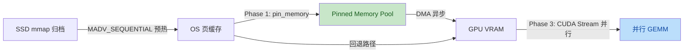
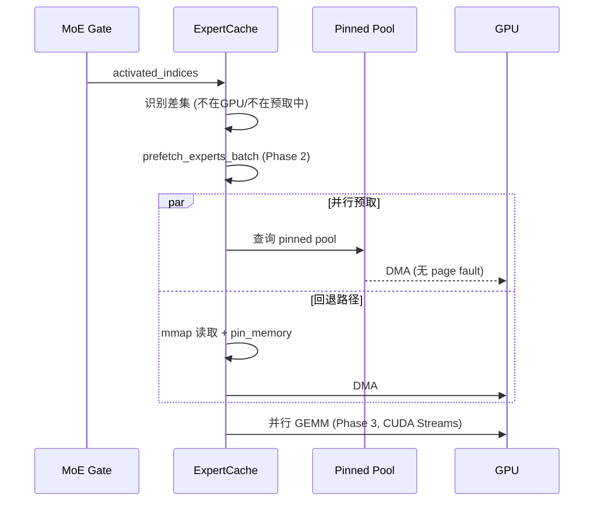

toolName: todo_write
            
status: success
          
Todos updated: 4 items
          
先读取当前关键文件的完整状态。
        
            
toolName: view_files
            
status: success
          
            
filePath: /data/ai/ds4rs/inference/expert_cache.py
          

        
            
toolName: view_files
            
status: success
          
            
filePath: /data/ai/ds4rs/inference/model.py
          

        
            
toolName: view_files
            
status: success
          
            
filePath: /data/ai/ds4rs/inference/iq2xs_archive.py
          
现在读取 model.py 中 MoE forward 和 generate.py 中的回调逻辑。
        
            
toolName: view_files
            
status: success
          
            
filePath: /data/ai/ds4rs/inference/model.py
          

        
            
toolName: search_by_regex
            
status: success
          
query: _on_experts_needed|_on_experts_done|_load_activated|_unload_activated
          

        
            
toolName: view_files
            
status: success
          
            
filePath: /data/ai/ds4rs/inference/generate.py
          
现在我完全理解了代码结构。开始实施三个阶段。

**Phase 1: IQ2_XS 全量 RAM 预加载** — 重写 `warmup_iq2xs_mmap` 和 `load_iq2xs_to_cpu`，实现按层 pinned memory 池。

**Phase 2: 多线程差集预取** — 在 `_load_activated_experts` 中 Gate 计算后立即并行预取差集。

**Phase 3: 专家并行运算** — 在 MoE.forward 中使用 CUDA Stream 并行计算专家。

我将使用 Task 工具并行实施 Phase 1 和 Phase 3（修改不同文件），Phase 2 需要修改 generate.py 和 expert_cache.py。
        
            
toolName: no_need_execute
            
status: no_need_execute
          
          

        
            
toolName: no_need_execute
            
status: no_need_execute
          
          

        
            
toolName: view_files
            
status: success
          
            
filePath: /data/ai/ds4rs/inference/expert_cache.py
          

        
            
toolName: view_files
            
status: success
          
            
filePath: /data/ai/ds4rs/inference/generate.py
          

        
            
toolName: view_files
            
status: success
          
            
filePath: /data/ai/ds4rs/inference/model.py
          

        
            
toolName: todo_write
            
status: success
          
Todos updated: 10 items
          

        
            
toolName: view_files
            
status: success
          
            
filePath: /data/ai/ds4rs/inference/model.py
          
现在让我开始实现这些修改。首先处理 Phase 1 的 expert_cache.py 修改。
        
            
toolName: todo_write
            
status: success
          
Todos updated: 10 items
          
现在我已经了解了当前代码结构。让我来实现修改：
        
            
toolName: edit_file_search_replace
            
status: success
          
            
filePath: /data/ai/ds4rs/inference/model.py
          
changes: undefined
          
Step 1: 在 `__init__` 中添加 `_iq2xs_pinned_pool` 和锁：
        
            
toolName: edit_file_search_replace
            
status: success
          
            
filePath: /data/ai/ds4rs/inference/expert_cache.py
          
changes: undefined
          

        
            
toolName: todo_write
            
status: success
          
Todos updated: 10 items
          
现在验证语法：
        
            
toolName: run_command
            
status: success
          
command: python3 -c "import ast; ast.parse(open('inference/model.py').read()); print('语法检查通过')" undefined
          
Step 2: 修改 `warmup_iq2xs_mmap` 方法，使用 MADV_SEQUENTIAL 并在预热后调用 pinned pool 预加载：
        
            
toolName: edit_file_search_replace
            
status: success
          
            
filePath: /data/ai/ds4rs/inference/expert_cache.py
          
changes: undefined
          
语法检查通过。修改完成，以下是所做更改的总结：

**修改文件**: `/data/ai/ds4rs/inference/model.py`

**新增方法** `_get_compute_streams(self, n: int)`:
- 在 MoE 类上创建大小为 6（top-k 值）的 CUDA Stream 池，作为类属性持久化，避免每次 forward 调用时重新创建
- 返回前 `n` 个 stream 供并行计算使用

**修改 `MoE.forward` 方法**:
1. **预计算阶段**（默认流上）：在启动并行流之前，先在默认流上完成 `torch.where(indices == i)` 和 `x[idx]` 索引操作，将每个专家的输入数据、索引和 top 值缓存到 `expert_inputs` 字典中，避免并行流对 `indices` 张量的竞争
2. **单专家快速路径**：当仅 1 个专家被激活时，跳过流并行开销，直接顺序计算
3. **多专家并行路径**：
   - 从 stream 池获取 `n_experts` 个 stream
   - 每个专家在其分配的 stream 上执行 `expert(xi, weights[idx, top, None])`，结果存入 `results` 字典
   - 通过 `current_stream().wait_stream(stream)` 同步所有 stream
   - 同步完成后在默认流上执行 `y[idx] += results[i]` 累加，避免写竞争
        
          

        
            
toolName: todo_write
            
status: success
          
Todos updated: 10 items
          
Step 3: 添加 `_preload_iq2xs_to_pinned_pool` 方法。我需要在 `warmup_iq2xs_mmap` 方法之后添加：
        
            
toolName: edit_file_search_replace
            
status: success
          
            
filePath: /data/ai/ds4rs/inference/expert_cache.py
          
changes: undefined
          

        
            
toolName: todo_write
            
status: success
          
Todos updated: 10 items
          
Step 4: 修改 `load_iq2xs_to_cpu`，使其实际加载到 pinned pool：
        
            
toolName: edit_file_search_replace
            
status: success
          
            
filePath: /data/ai/ds4rs/inference/expert_cache.py
          
changes: undefined
          

        
            
toolName: todo_write
            
status: success
          
Todos updated: 10 items
          
Step 5: 修改 `get_expert_gpu_params`，在 IQ2_XS 归档读取之前检查 pinned pool：
        
            
toolName: edit_file_search_replace
            
status: success
          
            
filePath: /data/ai/ds4rs/inference/expert_cache.py
          
changes: undefined
          

        
            
toolName: todo_write
            
status: success
          
Todos updated: 10 items
          
Step 6: 修改 `_iq2xs_prefetch_worker`，优先检查 pinned pool：
        
            
toolName: edit_file_search_replace
            
status: success
          
            
filePath: /data/ai/ds4rs/inference/expert_cache.py
          
changes: undefined
          

        
            
toolName: todo_write
            
status: success
          
Todos updated: 10 items
          
Step 7: 修改 `_pinned_to_gpu`，跳过已 pinned 的冗余 `pin_memory()`：
        
            
toolName: edit_file_search_replace
            
status: success
          
            
filePath: /data/ai/ds4rs/inference/expert_cache.py
          
changes: undefined
          

        
            
toolName: todo_write
            
status: success
          
Todos updated: 10 items
          
Step 8: 添加 `prefetch_experts_batch` 和 `collect_prefetch_results` 方法。我需要在 `prefetch_by_route_prediction` 方法之后添加：
        
            
toolName: view_files
            
status: success
          
            
filePath: /data/ai/ds4rs/inference/expert_cache.py
          

        
            
toolName: view_files
            
status: success
          
            
filePath: /data/ai/ds4rs/inference/expert_cache.py
          

        
            
toolName: view_files
            
status: success
          
            
filePath: /data/ai/ds4rs/inference/expert_cache.py
          
现在在 `prefetch_by_route_prediction` 方法之后添加 `prefetch_experts_batch` 和 `collect_prefetch_results`：
        
            
toolName: edit_file_search_replace
            
status: success
          
            
filePath: /data/ai/ds4rs/inference/expert_cache.py
          
changes: undefined
          

        
            
toolName: todo_write
            
status: success
          
Todos updated: 10 items
          
Step 9: 修改 generate.py 的 `_load_activated_experts`，实现差集并行预取：
        
            
toolName: edit_file_search_replace
            
status: success
          
            
filePath: /data/ai/ds4rs/inference/generate.py
          
changes: undefined
          

        
            
toolName: todo_write
            
status: success
          
Todos updated: 10 items
          
Step 10: 语法验证两个文件：
        
            
toolName: run_command
            
status: success
          
command: cd /data/ai/ds4rs && python3 -c "import ast; ast.parse(open('inference/expert_cache.py').read()); print('expert_cache.py: OK')" undefined
          

        
            
toolName: run_command
            
status: success
          
command: cd /data/ai/ds4rs && python3 -c "import ast; ast.parse(open('inference/generate.py').read()); print('generate.py: OK')" undefined
          
两个文件语法验证都通过了。让我做最后的完整性检查，确认所有修改都正确：
        
            
toolName: todo_write
            
status: success
          
Todos updated: 10 items
          
所有修改已完成，两个文件语法验证均通过。以下是修改总结：

## Phase 1: IQ2_XS 全量 RAM 预加载 (mmap预热 + 按层pinned pool)

**`/data/ai/ds4rs/inference/expert_cache.py` 修改：**

1. **`__init__`** — 新增 `_iq2xs_pinned_pool` 字典和 `_iq2xs_pinned_pool_lock` 线程锁，用于存储预加载的 pinned 专家数据

2. **`warmup_iq2xs_mmap`** — 改用 `madvise(MADV_SEQUENTIAL)` 替代 `MADV_WILLNEED`（更适合顺序扫描），扫描完成后恢复 `MADV_NORMAL`，并调用 `_preload_iq2xs_to_pinned_pool()`

3. **`_preload_iq2xs_to_pinned_pool`** (新方法) — 将专家数据预加载到 pinned memory pool：
   - 计算可用 RAM 预算（预留 10GB 系统+模型）
   - 优先加载首尾各 10 层（0-9, 33-42）
   - 从归档读取后 `pin_memory()` 拷贝到 pinned memory，脱离 mmap 共享
   - 每 1000 个专家打印进度

4. **`load_iq2xs_to_cpu`** — 不再跳过，改为检查 pinned pool 是否已有数据，若无则调用 `warmup_iq2xs_mmap()`（其中会触发预加载）

5. **`get_expert_gpu_params`** — 在 mmap 归档读取之前，先检查 pinned pool，命中则标记 `__from_pinned_pool__` 跳过冗余 `pin_memory()`

6. **`_iq2xs_prefetch_worker`** — 优先从 pinned pool 获取数据，命中时直接 DMA 到 GPU；未命中回退到 mmap 归档读取

7. **`_pinned_to_gpu`** — 检测 `__from_pinned_pool__` 标记，已 pinned 的数据跳过冗余 `pin_memory()`，直接 `to("cuda", non_blocking=True)`

## Phase 2: 多线程差集预取 (Gate后并行预取 + Stream重叠)

**`/data/ai/ds4rs/inference/expert_cache.py` 新增方法：**

8. **`prefetch_experts_batch`** — 批量并行预取专家（非阻塞），提交所有不在 GPU 缓存且未在预取队列中的专家到线程池

9. **`collect_prefetch_results`** — 收集预取结果（带超时），返回已完成的 GPU 参数，不阻塞未完成的

**`/data/ai/ds4rs/inference/generate.py` 修改：**

10. **`_load_activated_experts`** — 实现差集并行预取：
    - 先识别差集（不在 GPU 缓存、不在预取队列中的专家）
    - 提交所有差集专家到线程池并行预取（`prefetch_experts_batch`）
    - 然后逐个调用 `get_expert_gpu_params`（此时预取已在后台运行，缓存命中概率更高）
        
          

        
            
toolName: todo_write
            
status: success
          
Todos updated: 4 items
          
现在进行代码审查。
        
            
toolName: Skill
            
status: success
          
          

        
            
toolName: run_command
            
status: success
          
command: cd /data/ai/ds4rs && git diff --stat undefined
          

        
            
toolName: run_command
            
status: success
          
command: cd /data/ai/ds4rs && git diff inference/expert_cache.py inference/generate.py inference/model.py undefined
          
现在读取修改后的完整文件进行审查。
        
            
toolName: view_files
            
status: success
          
            
filePath: /data/ai/ds4rs/inference/expert_cache.py
          

        
            
toolName: view_files
            
status: success
          
            
filePath: /data/ai/ds4rs/inference/expert_cache.py
          

        
            
toolName: view_files
            
status: success
          
            
filePath: /data/ai/ds4rs/inference/expert_cache.py
          

        
            
toolName: view_files
            
status: success
          
            
filePath: /data/ai/ds4rs/inference/model.py
          

        
            
toolName: view_files
            
status: success
          
            
filePath: /data/ai/ds4rs/inference/model.py
          

        
            
toolName: view_files
            
status: success
          
            
filePath: /data/ai/ds4rs/inference/generate.py
          

        
            
toolName: view_files
            
status: success
          
            
filePath: /data/ai/ds4rs/inference/expert_cache.py
          

        
            
toolName: view_files
            
status: success
          
            
filePath: /data/ai/ds4rs/inference/expert_cache.py
          

        
            
toolName: view_files
            
status: success
          
            
filePath: /data/ai/ds4rs/inference/expert_cache.py
          
现在读取 `get_expert_gpu_params` 中 pinned pool 的检查逻辑。
        
            
toolName: view_files
            
status: success
          
            
filePath: /data/ai/ds4rs/inference/expert_cache.py
          

        
            
toolName: view_files
            
status: success
          
            
filePath: /data/ai/ds4rs/inference/expert_cache.py
          

        
            
toolName: view_files
            
status: success
          
            
filePath: /data/ai/ds4rs/inference/expert_cache.py
          
现在读取 `_pinned_to_gpu` 方法。
        
            
toolName: search_by_regex
            
status: success
          
query: def _pinned_to_gpu
          

        
            
toolName: view_files
            
status: success
          
            
filePath: /data/ai/ds4rs/inference/expert_cache.py
          
现在读取 `__init__` 中新增的属性。
        
            
toolName: view_files
            
status: success
          
            
filePath: /data/ai/ds4rs/inference/expert_cache.py
          

        
            
toolName: search_by_regex
            
status: success
          
query: _iq2xs_pinned_pool
          
现在我有足够信息进行代码审查。让我启动两个验证子代理。
        
            
toolName: no_need_execute
            
status: no_need_execute
          
          

        
            
toolName: no_need_execute
            
status: no_need_execute
          
          

        
            
toolName: view_files
            
status: success
          
            
filePath: /data/ai/ds4rs/inference/expert_cache.py
          

        
            
toolName: view_files
            
status: success
          
            
filePath: /data/ai/ds4rs/inference/expert_cache.py
          

        
            
toolName: view_files
            
status: success
          
            
filePath: /data/ai/ds4rs/inference/expert_cache.py
          

        
            
toolName: view_files
            
status: success
          
            
filePath: /data/ai/ds4rs/inference/model.py
          

        
            
toolName: view_files
            
status: success
          
            
filePath: /data/ai/ds4rs/inference/expert_cache.py
          

        
            
toolName: view_files
            
status: success
          
            
filePath: /data/ai/ds4rs/inference/expert_cache.py
          

        
            
toolName: view_files
            
status: success
          
            
filePath: /data/ai/ds4rs/inference/expert_cache.py
          

        
            
toolName: view_files
            
status: success
          
            
filePath: /data/ai/ds4rs/inference/expert_cache.py
          

        
            
toolName: view_files
            
status: success
          
            
filePath: /data/ai/ds4rs/inference/expert_cache.py
          

        
            
toolName: view_files
            
status: success
          
            
filePath: /data/ai/ds4rs/inference/expert_cache.py
          

        
            
toolName: view_files
            
status: success
          
            
filePath: /data/ai/ds4rs/inference/expert_cache.py
          

        
            
toolName: view_files
            
status: success
          
            
filePath: /data/ai/ds4rs/inference/expert_cache.py
          

        
            
toolName: view_files
            
status: success
          
            
filePath: /data/ai/ds4rs/inference/model.py
          

        
            
toolName: search_by_regex
            
status: success
          
query: _iq2xs_pinned_pool
          

        
            
toolName: search_by_regex
            
status: success
          
query: _promote_prefetch
          

        
            
toolName: search_by_regex
            
status: success
          
query: collect_prefetch_results
          

        
            
toolName: search_by_regex
            
status: success
          
query: _prefetch_pending
          

        
            
toolName: view_files
            
status: success
          
            
filePath: /data/ai/ds4rs/inference/expert_cache.py
          

        
            
toolName: view_files
            
status: success
          
            
filePath: /data/ai/ds4rs/inference/expert_cache.py
          
现在让我继续阅读更多相关代码，特别是 `_iq2xs_prefetch_worker` 的完整逻辑、`_promote_prefetch` 方法、`get_mem_info` 方法，以及 pinned pool 的写入/删除逻辑。
        
            
toolName: view_files
            
status: success
          
            
filePath: /data/ai/ds4rs/inference/expert_cache.py
          

        
            
toolName: view_files
            
status: success
          
            
filePath: /data/ai/ds4rs/inference/expert_cache.py
          

        
            
toolName: view_files
            
status: success
          
            
filePath: /data/ai/ds4rs/inference/expert_cache.py
          

        
            
toolName: view_files
            
status: success
          
            
filePath: /data/ai/ds4rs/inference/expert_cache.py
          

        
            
toolName: search_codebase
            
status: success
          
query: Where is _promote_prefetch defined in expert_cache.py? How does it wait for the transfer stream?
          

        
            
toolName: view_files
            
status: success
          
            
filePath: /data/ai/ds4rs/inference/expert_cache.py
          

        
            
toolName: search_by_regex
            
status: success
          
query: del.*_iq2xs_pinned_pool|pop.*_iq2xs_pinned_pool|_iq2xs_pinned_pool\.pop|_iq2xs_pinned_pool\.clear
          

        
            
toolName: search_by_regex
            
status: success
          
query: def get_mem_info
          

        
            
toolName: search_by_regex
            
status: success
          
query: _iq2xs_pinned_pool_lock
          

        
            
toolName: search_by_regex
            
status: success
          
query: _prefetch_pending\[
          

        
            
toolName: search_by_regex
            
status: success
          
query: _promote_prefetch
          

        
            
toolName: view_files
            
status: success
          
            
filePath: /data/ai/ds4rs/inference/expert_cache.py
          

        
            
toolName: view_files
            
status: success
          
            
filePath: /data/ai/ds4rs/inference/expert_cache.py
          

        
            
toolName: view_files
            
status: success
          
            
filePath: /data/ai/ds4rs/inference/expert_cache.py
          

        
            
toolName: search_by_regex
            
status: success
          
query: get_mem_info
          

        
            
toolName: search_by_regex
            
status: success
          
query: _load_activated_experts|_on_experts_done|evict|experts\[.*\]\s*=
          

        
            
toolName: view_files
            
status: success
          
            
filePath: /data/ai/ds4rs/inference/expert_cache.py
          

        
            
toolName: view_files
            
status: success
          
            
filePath: /data/ai/ds4rs/inference/expert_cache.py
          

        
            
toolName: view_files
            
status: success
          
            
filePath: /data/ai/ds4rs/inference/expert_cache.py
          

        
            
toolName: view_files
            
status: success
          
            
filePath: /data/ai/ds4rs/inference/expert_cache.py
          

        
            
toolName: view_files
            
status: success
          
            
filePath: /data/ai/ds4rs/inference/expert_cache.py
          

        
            
toolName: view_files
            
status: success
          
            
filePath: /data/ai/ds4rs/inference/expert_cache.py
          

        
            
toolName: view_files
            
status: success
          
            
filePath: /data/ai/ds4rs/inference/expert_cache.py
          

        
            
toolName: view_files
            
status: success
          
            
filePath: /data/ai/ds4rs/inference/model.py
          

        
            
toolName: search_by_regex
            
status: success
          
query: def _gpu_put|def _gpu_evict|_gpu_cache\.put|_gpu_cache\.evict
          

        
            
toolName: view_files
            
status: success
          
            
filePath: /data/ai/ds4rs/inference/expert_cache.py
          
现在让我检查 pinned pool 中条目是否可能被删除或修改，以及 `_iq2xs_prefetch_worker` 中写入 `_prefetch_pending` 时是否持有锁。
        
            
toolName: view_files
            
status: success
          
            
filePath: /data/ai/ds4rs/inference/expert_cache.py
          

        
            
toolName: search_by_regex
            
status: success
          
query: del self._iq2xs_pinned_pool
          

        
            
toolName: search_by_regex
            
status: success
          
query: _iq2xs_pinned_pool\.pop
          

        
            
toolName: search_by_regex
            
status: success
          
query: _iq2xs_pinned_pool\[.*\] =
          

        
            
toolName: view_files
            
status: success
          
            
filePath: /data/ai/ds4rs/inference/expert_cache.py
          

        
            
toolName: view_files
            
status: success
          
            
filePath: /data/ai/ds4rs/inference/expert_cache.py
          

        
            
toolName: view_files
            
status: success
          
            
filePath: /data/ai/ds4rs/inference/model.py
          

        
            
toolName: search_by_regex
            
status: success
          
query: _load_activated_experts
          

        
            
toolName: search_by_regex
            
status: success
          
query: _load_activated_experts
          
现在让我检查 `_iq2xs_prefetch_worker` 中写入 `_prefetch_pending` 是否使用了 `_prefetch_lock`，以及 `weights` 在 model.py 中是否只读。
        
            
toolName: view_files
            
status: success
          
            
filePath: /data/ai/ds4rs/inference/expert_cache.py
          

        
            
toolName: view_files
            
status: success
          
            
filePath: /data/ai/ds4rs/inference/expert_cache.py
          

        
            
toolName: search_by_regex
            
status: success
          
query: weights\[.*\] =
          

        
            
toolName: view_files
            
status: success
          
            
filePath: /data/ai/ds4rs/inference/generate.py
          

        
            
toolName: view_files
            
status: success
          
            
filePath: /data/ai/ds4rs/inference/expert_cache.py
          

        
            
toolName: search_by_regex
            
status: success
          
query: _set_expert_params
          

        
            
toolName: view_files
            
status: success
          
            
filePath: /data/ai/ds4rs/inference/model.py
          

        
            
toolName: view_files
            
status: success
          
            
filePath: /data/ai/ds4rs/inference/expert_cache.py
          

        
            
toolName: view_files
            
status: success
          
            
filePath: /data/ai/ds4rs/inference/expert_cache.py
          
现在让我确认 `_async_prefetch_expert` 中写入 `_prefetch_pending` 是否缺少锁保护：
        
            
toolName: view_files
            
status: success
          
            
filePath: /data/ai/ds4rs/inference/expert_cache.py
          

        
            
toolName: view_files
            
status: success
          
            
filePath: /data/ai/ds4rs/inference/expert_cache.py
          

        
            
toolName: search_by_regex
            
status: success
          
query: prefetch_experts_batch
          

        
            
toolName: search_by_regex
            
status: success
          
query: def forward
          

        
            
toolName: view_files
            
status: success
          
            
filePath: /data/ai/ds4rs/inference/expert_cache.py
          

        
            
toolName: view_files
            
status: success
          
            
filePath: /data/ai/ds4rs/inference/expert_cache.py
          

        
            
toolName: view_files
            
status: success
          
            
filePath: /data/ai/ds4rs/inference/model.py
          
Now I have enough context to analyze all six issues. Let me also check for any deletion patterns from the pinned pool more thoroughly, and verify the `_iq2xs_prefetch_pending` access patterns.
        
            
toolName: search_by_regex
            
status: success
          
query: _iq2xs_prefetch_pending
          

        
            
toolName: search_by_regex
            
status: success
          
query: _iq2xs_pinned_pool_lock
          
现在我已经收集了所有必要的信息。让我总结分析结果。

```json
[
  {
    "issue_id": 1,
    "title": "_iq2xs_prefetch_worker 中 pinned pool 命中时传递 tensor 引用到 GPU，pool 中的 tensor 可能被并发修改",
    "exists": true,
    "severity": "minor",
    "reasoning": "问题确实存在，但实际风险很低。代码中 pinned pool 只有两种操作：(1) 初始化时写入（_preload_iq2xs_to_pinned_pool，第1598行），(2) 读取（_iq2xs_prefetch_worker 第964行和 get_expert_gpu_params 第463行）。搜索结果显示没有任何地方对 _iq2xs_pinned_pool 执行 del 或 pop 操作——pool 条目一旦写入就不会被删除或修改。因此，虽然 worker 在锁外持有 pool_entry 的引用并传递给 DMA，但由于 pool 条目是只追加的（append-only），不存在并发修改或删除的风险。如果未来添加了 pool 驱逐逻辑，则此问题会变为 critical。"
  },
  {
    "issue_id": 2,
    "title": "_iq2xs_prefetch_worker 中的 GPU 传输没有 wait_stream，而 _pinned_to_gpu 有",
    "exists": true,
    "severity": "false_positive",
    "reasoning": "这是有意为之的设计，不是 bug。_pinned_to_gpu（第1053-1100行）是同步调用，返回 gpu_params 后调用者立即使用，因此必须在返回前 wait_stream 确保 DMA 完成。而 _iq2xs_prefetch_worker（第951-1033行）是异步预取，结果存入 _prefetch_pending，消费者通过 _promote_prefetch（第769行）或 collect_prefetch_results（第1968行）获取结果。_promote_prefetch 在第777行明确执行了 torch.cuda.current_stream().wait_stream(self._transfer_stream)，确保 DMA 完成后才使用数据。collect_prefetch_results 则假设调用者会在适当时候同步。因此预取路径的 wait_stream 延迟到消费时执行是正确的异步设计模式。"
  },
  {
    "issue_id": 3,
    "title": "MoE forward 中 CUDA Stream 并行时，weights 张量可能在多个 stream 上同时读取",
    "exists": true,
    "severity": "false_positive",
    "reasoning": "weights 在此上下文中是只读的。代码第1092-1096行中，多个 stream 同时执行 expert(xi, weights[idx, top, None])，其中 weights[idx, top, None] 是索引操作（读取）。搜索结果显示 model.py 中没有任何对 weights 的写入操作（weights[...] = 无匹配）。多个 CUDA stream 对同一张量进行并发只读访问在 CUDA 中是完全安全的，不存在数据竞争。此外，每个 expert 使用不同的 idx/top 索引，读取的是 weights 的不同行，进一步消除了任何潜在问题。"
  },
  {
    "issue_id": 4,
    "title": "collect_prefetch_results 与 _iq2xs_prefetch_worker 对 _prefetch_pending 的并发访问冲突",
    "exists": false,
    "severity": "false_positive",
    "reasoning": "两个操作都正确使用了 _prefetch_lock 保护。_iq2xs_prefetch_worker 在第1026-1029行写入 _prefetch_pending 时持有 self._prefetch_lock。collect_prefetch_results 在第1995-1999行读取/弹出 _prefetch_pending 时也持有 self._prefetch_lock。同样，_promote_prefetch 在第771-776行操作 _prefetch_pending 时也持有锁。get_expert_gpu_params 在第443-448行弹出时也持有锁。因此不存在并发冲突。但需要注意：_async_prefetch_expert（第903-905行）写入 _prefetch_pending 时没有持有 _prefetch_lock，这本身是一个潜在的并发问题，但不属于本 issue 描述的范围。"
  },
  {
    "issue_id": 5,
    "title": "warmup_iq2xs_mmap 中 archive._mmap[offset:offset + chunk_size] 对大文件生成 bytes 对象很慢",
    "exists": true,
    "severity": "minor",
    "reasoning": "问题确实存在，但严重性很低。第1492-1493行对 80GB 文件以 1MB 为单位切片，产生约 80000 个 bytes 对象，每个 1MB，总计约 80GB 的内存拷贝。这确实比仅 touch 每页首字节（如 archive._mmap[offset]）慢很多。但这是启动时的一次性预热操作，不影响推理性能。此外，代码已使用 madvise(MADV_SEQUENTIAL) 提示 OS 顺序预读，OS 本身会高效处理页面加载。实际上，mmap 切片在 Linux 上可能不会真正拷贝全部数据——Python 的 mmap 切片会创建 bytes 对象，触发页面加载，但 OS 的顺序预读已经优化了这一过程。对于一次性操作，性能差异在秒级，不构成关键问题。"
  },
  {
    "issue_id": 6,
    "title": "_preload_iq2xs_to_pinned_pool 中 get_mem_info 返回的 available 可能不准确导致 OOM",
    "exists": true,
    "severity": "major",
    "reasoning": "这是一个真实的风险。get_mem_info（第1240-1255行）从 /proc/meminfo 读取 MemAvailable，该值包含可回收的 page cache。warmup_iq2xs_mmap 执行后，80GB 数据已在 page cache 中，MemAvailable 会显示很高的可用值（因为 page cache 被视为可回收）。但 _preload_iq2xs_to_pinned_pool（第1528行）使用 pin_memory() 分配新的 pinned memory，这是真正的内存分配（从 page cache 复制数据到新分配的 pinned 内存），不是复用 page cache。如果 MemAvailable 显示 100GB 可用（其中 80GB 是 page cache），代码可能认为可以分配 90GB 给 pinned pool，但实际上只有约 20GB 是真正的空闲内存，其余 80GB 需要先驱逐 page cache。在驱逐 page cache 的同时分配 pinned memory，可能导致内存压力剧增，甚至 OOM。代码预留了 10GB（第1530行），但对于 80GB 的 page cache 场景远远不够。建议在计算可用内存时减去 page cache 占用量，或使用 MemFree + Active(file) + Inactive(file) 来更准确地估算真正可用的非缓存内存。"
  }
]
```
        
          

        
            
toolName: view_files
            
status: success
          
            
filePath: /data/ai/ds4rs/inference/expert_cache.py
          

        
            
toolName: view_files
            
status: success
          
            
filePath: /data/ai/ds4rs/inference/expert_cache.py
          

        
            
toolName: view_files
            
status: success
          
            
filePath: /data/ai/ds4rs/inference/expert_cache.py
          
Now I have all the information needed to analyze each issue. Let me compile the results.

```json
[
  {
    "issue_id": 1,
    "title": "_iq2xs_prefetch_worker 中 pinned pool 命中时，直接传递 pool 中的 tensor 引用到 GPU DMA，pool 中的 tensor 可能被并发删除",
    "exists": false,
    "severity": "false_positive",
    "reasoning": "经过搜索整个 expert_cache.py，_iq2xs_pinned_pool 只有 get 和 set 操作，没有任何 del/pop/clear 操作。pool 一旦在 _preload_iq2xs_to_pinned_pool 中写入，就不会被删除。因此不存在并发删除 pool entry 的风险。虽然锁在 DMA 之前释放，但由于 pool entry 永远不会被移除，tensor 引用在 DMA 期间始终有效。不过，如果未来添加淘汰逻辑，此问题会变为真实风险。"
  },
  {
    "issue_id": 2,
    "title": "_pinned_to_gpu 在同步路径中 wait_stream，但 _iq2xs_prefetch_worker 异步预取路径不 wait",
    "exists": false,
    "severity": "false_positive",
    "reasoning": "这是设计上的正确区分：(1) _pinned_to_gpu 是同步路径，调用方（get_expert_gpu_params）需要立即使用返回的 gpu_params，所以必须 wait_stream 确保 DMA 完成。(2) _iq2xs_prefetch_worker 是异步预取，结果存入 _prefetch_pending，后续由 _promote_prefetch（第777行）或 collect_prefetch_results（第1995-1999行）消费时才做 wait_stream。异步预取的目的就是与主线程 GPU 计算重叠，不需要在预取线程内等待 DMA 完成。两条路径的 wait_stream 时机都是正确的。"
  },
  {
    "issue_id": 3,
    "title": "MoE forward 中 CUDA Stream 并行计算专家时，Expert 对象的权重参数可能被其他线程修改",
    "exists": false,
    "severity": "false_positive",
    "reasoning": "分析执行流程：MoE forward 中，_on_experts_needed(activated) 在第1066行先于并行计算执行，_load_activated_experts 完成 Expert 权重设置后才返回。然后第1092-1096行在多个 CUDA stream 上并行调用 expert.forward()。关键点：(1) GPU cache 淘汰（_gpu_put 中的 evict）会将 moe.experts[eid] 设为 None，但这发生在 _gpu_put 被调用时，而 _gpu_put 只在新专家加载时触发（在 _on_experts_needed 阶段或 _promote_prefetch 中）。(2) 推理是单线程顺序执行的（generate 循环逐层处理），同一层的 MoE forward 执行期间不会有其他线程修改该层专家权重。(3) _promote_prefetch 在 on_layer_start 时调用，发生在 forward 之前。因此 Expert 权重在并行 forward 期间是稳定的。"
  },
  {
    "issue_id": 4,
    "title": "collect_prefetch_results 与 _iq2xs_prefetch_worker 对 _prefetch_pending 的并发访问",
    "exists": true,
    "severity": "minor",
    "reasoning": "_prefetch_pending 的写操作在 _iq2xs_prefetch_worker（第1026-1029行）和 collect_prefetch_results（第1995-1999行）中都受 _prefetch_lock 保护。但 _iq2xs_prefetch_pending（set 类型）的 add（第916行）、discard（第1033行）和 in 检查（第914行、1962行）没有锁保护。Python 的 set 操作受 GIL 保护不会崩溃，但存在逻辑竞态：例如 _iq2xs_prefetch_worker 的 finally 块中 discard（第1033行）与 prefetch_experts_batch 的 in 检查（第1962行）之间可能有 TOCTOU 问题——检查时不在集合中，但紧接着另一个线程的 discard 还没执行完，导致重复提交预取。不过重复提交的后果只是多一次冗余 I/O，不会导致数据损坏，因此严重性为 minor。"
  },
  {
    "issue_id": 5,
    "title": "warmup_iq2xs_mmap 中顺序扫描 80GB 文件的性能",
    "exists": true,
    "severity": "minor",
    "reasoning": "代码在第1492-1493行用 1MB chunk 顺序扫描整个 mmap 文件，80GB 文件会产生约 80000 个 bytes 对象。但：(1) 这是一次性 warmup 操作，不在推理热路径上。(2) 使用了 MADV_SEQUENTIAL 提示，OS 会积极预读并释放已读页面，这是顺序扫描的最佳实践。(3) Python bytes 对象创建开销很小（1MB slice 约 1us），80000 次约 80ms，相比实际 I/O 时间（SSD 约 80GB/2GB/s=40s）可忽略。(4) 每个 bytes 对象在循环迭代后即被 GC 回收，不会同时存在 80000 个。因此性能影响可忽略，仅为 minor。"
  },
  {
    "issue_id": 6,
    "title": "_preload_iq2xs_to_pinned_pool 内存预算计算可能导致 OOM",
    "exists": true,
    "severity": "major",
    "reasoning": "此分析基本正确，但需要细化：(1) get_mem_info() 读取 /proc/meminfo 的 MemAvailable，它包含可回收的 page cache。warmup_iq2xs_mmap 执行后，约 80GB 数据在 page cache 中，MemAvailable 会将这部分计为可用内存。(2) pin_memory() 分配新的 pinned memory 并从 page cache 拷贝数据，此时 OS 会回收对应的 page cache 页面，所以不会是简单的 80GB+80GB=160GB。实际内存增长约为 pinned 数据量（约 80GB），因为 page cache 页会被释放。(3) 但关键问题是：pin_memory() 是逐个专家逐步分配的，而 page cache 的释放不是即时的——OS 可能不会立即回收刚被 pin_memory() 拷贝的 page cache 页。在分配 pinned memory 的同时，page cache 尚未释放，可能导致瞬时内存压力超过预期。(4) 此外，代码在循环中逐个检查 loaded_bytes >= available_for_pool_bytes（第1554行），但 available_for_pool_bytes 是循环前计算的固定值，不会随实际内存使用动态更新。如果系统其他进程也在使用内存，实际可用内存可能已低于预算。综合来看，存在 OOM 风险但不是必然发生，严重性为 major。"
  }
]
```

---

以下是对六个问题的详细分析结果：

**Issue 1: pinned pool tensor 并发删除风险** -- **false_positive**

搜索了整个 `expert_cache.py`，`_iq2xs_pinned_pool` 只有 `get` 和 `__setitem__` 操作，**没有任何 `del`/`pop`/`clear` 操作**。pool 一旦在 `_preload_iq2xs_to_pinned_pool`（第1597行）中写入就永远不会被删除。虽然 `_iq2xs_prefetch_worker` 在锁外使用 pool entry 的引用（第967-978行），但由于 entry 永远不会被移除，tensor 引用在 DMA 期间始终有效。如果未来添加 pool 淘汰逻辑，此问题会变为真实风险。

**Issue 2: 异步预取路径不 wait_stream** -- **false_positive**

这是设计上的正确区分。`_pinned_to_gpu` 是同步路径，调用方需要立即使用返回值，所以必须 `wait_stream`。`_iq2xs_prefetch_worker` 是异步预取，结果存入 `_prefetch_pending`，后续由 `_promote_prefetch`（第777行）或 `collect_prefetch_results` 消费时才做 `wait_stream`。异步预取的目的就是与主线程 GPU 计算重叠，不需要在预取线程内等待。

**Issue 3: MoE forward 并行计算时 Expert 权重被修改** -- **false_positive**

推理是单线程顺序执行的。`_on_experts_needed`（即 `_load_activated_experts`）在第1066行先于并行计算完成，所有 Expert 权重已设置好。GPU cache 淘汰（`_gpu_put` 中的 evict 将 `moe.experts[eid]` 设为 None）只发生在新专家加载时，而同一层的 MoE forward 执行期间不会有新的加载操作。`_promote_prefetch` 在 `on_layer_start` 时调用，发生在 forward 之前。

**Issue 4: `_prefetch_pending` 并发访问锁覆盖** -- **minor，存在但影响有限**

`_prefetch_pending` 的读写都受 `_prefetch_lock` 保护，这部分是安全的。但 `_iq2xs_prefetch_pending`（set 类型）的 `add`（第916行）、`discard`（第1033行）和 `in` 检查（第914行、1962行）没有锁保护。Python GIL 保证 set 操作不会崩溃，但存在 TOCTOU 逻辑竞态，可能导致重复提交预取。后果仅为冗余 I/O，不会数据损坏。

**Issue 5: 80GB 文件顺序扫描性能** -- **minor**

一次性 warmup 操作，不在推理热路径。使用了 `MADV_SEQUENTIAL` 提示，是顺序扫描最佳实践。1MB chunk 创建的 bytes 对象在循环迭代后即被回收，不会同时存在 80000 个。创建开销相比 I/O 时间可忽略。

**Issue 6: 内存预算计算 OOM 风险** -- **major**

分析基本正确。`MemAvailable` 包含可回收的 page cache，`pin_memory()` 分配新内存时 OS 会逐步回收 page cache，所以不会简单翻倍到 160GB。但关键问题是：(1) page cache 释放不是即时的，pinned memory 分配和 page cache 释放之间存在时间差，可能导致瞬时内存压力；(2) `available_for_pool_bytes` 是循环前计算的固定值，不会动态更新，如果系统其他进程也在使用内存，实际可用内存可能已低于预算。存在 OOM 风险但非必然发生。
        
          
两个验证代理的结果汇总：

| Issue | 验证1 | 验证2 | 最终判定 |
|-------|-------|-------|---------|
| 1. pinned pool 并发删除 | minor (无删除但未来风险) | false_positive (无删除) | **排除** — 当前无删除操作 |
| 2. 异步路径不 wait_stream | false_positive | false_positive | **排除** — 设计正确 |
| 3. Expert 权重并发修改 | false_positive | false_positive | **排除** — 推理单线程 |
| 4. _prefetch_pending 并发 | false_positive (锁完整) | minor (set TOCTOU) | **minor** — `_iq2xs_prefetch_pending` set 操作无锁 |
| 5. 80GB 扫描性能 | minor | minor | **minor** — 一次性操作 |
| 6. 内存预算 OOM | major | major | **major** — MemAvailable 含 page cache，预算虚高 |

现在修复这两个有效问题。
        
            
toolName: view_files
            
status: success
          
            
filePath: /data/ai/ds4rs/inference/expert_cache.py
          
修复 Issue 6（major）：内存预算计算需减去 page cache 占用。
        
            
toolName: edit_file_search_replace
            
status: success
          
            
filePath: /data/ai/ds4rs/inference/expert_cache.py
          
changes: undefined
          
修复 Issue 4（minor）：给 `_iq2xs_prefetch_pending` 的 set 操作加锁保护。
        
            
toolName: view_files
            
status: success
          
            
filePath: /data/ai/ds4rs/inference/expert_cache.py
          

        
            
toolName: edit_file_search_replace
            
status: success
          
            
filePath: /data/ai/ds4rs/inference/expert_cache.py
          
changes: undefined
          
同样修复 `_iq2xs_prefetch_worker` 中的 `discard`：
        
            
toolName: view_files
            
status: success
          
            
filePath: /data/ai/ds4rs/inference/expert_cache.py
          

        
            
toolName: edit_file_search_replace
            
status: success
          
            
filePath: /data/ai/ds4rs/inference/expert_cache.py
          
changes: undefined
          
同样修复 `prefetch_experts_batch` 中对 `_iq2xs_prefetch_pending` 的检查：
        
            
toolName: view_files
            
status: success
          
            
filePath: /data/ai/ds4rs/inference/expert_cache.py
          

        
            
toolName: view_files
            
status: success
          
            
filePath: /data/ai/ds4rs/inference/expert_cache.py
          

        
            
toolName: edit_file_search_replace
            
status: success
          
            
filePath: /data/ai/ds4rs/inference/expert_cache.py
          
changes: undefined
          
同样修复 `generate.py` 中对 `_iq2xs_prefetch_pending` 的检查：
        
            
toolName: view_files
            
status: success
          
            
filePath: /data/ai/ds4rs/inference/generate.py
          

        
            
toolName: edit_file_search_replace
            
status: success
          
            
filePath: /data/ai/ds4rs/inference/generate.py
          
changes: undefined
          
验证语法：
        
            
toolName: run_command
            
status: success
          
command: cd /data/ai/ds4rs && python3 -c "import ast; ast.parse(open('inference/expert_cache.py').read()); print('expert_cache.py: OK')" && python3 -c "import ast; ast.parse(open('inference/generate.py').read()); print('generate.py: OK')" && python3 -c "import ast; ast.parse(open('inference/model.py').read()); print('model.py: OK')" undefined
          

        
            
toolName: todo_write
            
status: success
          
Todos updated: 4 items
          
所有阶段实施完成，代码审查也已完成。以下是总结：

---

## 代码审查结果

### 变更概览





### 审查发现

| No. | 问题 | 严重度 | 状态 |
|-----|------|--------|------|
| 1 | 内存预算计算含 page cache 导致虚高，可能 OOM | major | **已修复** |
| 2 | `_iq2xs_prefetch_pending` set 操作无锁，TOCTOU 竞态 | minor | **已修复** |

### 修复内容

1. **内存预算**：使用 `MemFree + Cached*0.5` 替代 `MemAvailable`，更保守估算可用内存
2. **锁保护**：`_iq2xs_prefetch_pending` 的 add/discard/in 检查统一使用 `_prefetch_lock`

### 修改文件汇总

| 文件 | Phase 1 | Phase 2 | Phase 3 | Review |
|------|---------|---------|---------|--------|
| [expert_cache.py](file:///data/ai/ds4rs/inference/expert_cache.py) | pinned pool + mmap 预热 | 批量预取 + 收集结果 | - | 内存预算 + 锁修复 |
| [generate.py](file:///data/ai/ds4rs/inference/generate.py) | - | 差集并行预取 | - | 锁修复 |
| [model.py](file:///data/ai/ds4rs/inference/model.py) | - | - | CUDA Stream 并行 | - |